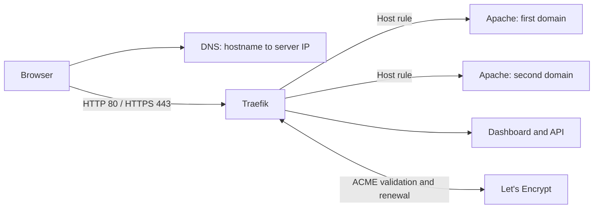

# IS 373 Hosting Lab

Build a public Ubuntu web server with Docker, Traefik, Apache HTTP Server, and automatic Let's Encrypt HTTPS. This mini textbook takes you from DNS records to a working multi-domain server, then teaches you how to operate and troubleshoot it.

This repository owns **hosting infrastructure**. The complementary [is373_ci_cd](https://github.com/kaw393939/is373_ci_cd) repository owns **application code, tests, and image releases**. Each works independently. [Chapter 10](book/10-application-delivery.md) connects them using one small routing adapter and a public release check.

Live classroom calculator: [calc.mywebclass.org](https://calc.mywebclass.org).
See the [dated deployment evidence](book/deployments/2026-09-29-calculator.md) for
the tested release, HTTPS verification, and observed limits.

**Audience:** students comfortable opening a terminal but new to running public web infrastructure. **Lab target:** a fresh Ubuntu 24.04 LTS VPS, a public IPv4 address, and domains you control. Budget about 90 minutes, plus DNS propagation. A VPS and domain registration may cost money.

## What you build



Every website hostname gets its own official `httpd` container and editable welcome page. Traefik is the only container publishing host ports. It routes requests, redirects HTTP to HTTPS, and manages certificates. Docker restarts the services after reboot.

## Read the mini textbook

| Chapter | Learning outcome |
|---|---|
| [1. The request's journey](book/01-architecture.md) | Distinguish DNS, ports, TLS, routers, and services |
| [2. Prepare the server and DNS](book/02-server-and-dns.md) | Connect over SSH and point names at your VPS |
| [3. Install Docker](book/03-docker.md) | Understand images, containers, networks, and mounts |
| [4. Build the hosting stack](book/04-deploy.md) | Generate and deploy custom Apache welcome pages |
| [5. HTTPS and the dashboard](book/05-https-dashboard.md) | Explain certificate issuance and inspect routing |
| [6. Diagnose failures](book/06-troubleshooting.md) | Locate failures by testing one layer at a time |
| [7. Operate and extend](book/07-operations.md) | Add sites, back up data, and update deliberately |
| [8. Assessment and glossary](book/08-assessment.md) | Demonstrate understanding with practical exercises |
| [9. Configuration file walkthrough](book/09-configuration-files.md) | Read complete Compose, Traefik, HTML, and host configuration copies |
| [10. Application delivery](book/10-application-delivery.md) | Route the companion's tested releases through HTTPS and verify updates/rollback |

**Want to see the actual files first?** Browse the [complete example stack](examples/full-stack/README.md), including the [Compose file](examples/full-stack/compose.yaml), [commented Traefik configuration](examples/full-stack/traefik.yml), optional overlays, and all five welcome pages. [Host configuration copies](examples/host-config/README.md) cover APT, firewall commands, and DNS records.

## Quick start

Run these commands **on a fresh Ubuntu VPS**, after setting your DNS records. Do not start a second stack on a server already using ports 80 and 443.

```bash
sudo apt-get update
sudo apt-get install -y git python3
git clone https://github.com/kaw393939/373_hosting.git
cd 373_hosting
sudo bash scripts/install-docker.sh
cp examples/hosting.example.json hosting.json
nano hosting.json
```

Replace every example hostname and the email address with your own. The dashboard hostname must be different from all website hostnames.

```bash
python3 scripts/configure.py --config hosting.json --output runtime
sudo docker compose -f runtime/compose.yaml config --quiet
sudo docker compose -f runtime/compose.yaml up -d
python3 scripts/verify.py --config hosting.json
```

Certificate issuance may take a few minutes; rerun verification after startup. Open `https://YOUR_DASHBOARD_HOST/dashboard/` (keep the final slash).

**Lab access:** the dashboard is deliberately password-free, matching the classroom demonstration. Anyone who can reach it can view routing and service metadata. [Chapter 5](book/05-https-dashboard.md) explains how to add Basic Authentication before using this as a longer-lived deployment. Traefik's dashboard is an inspection interface; edit Compose to change the stack.

## Project map

```text
book/                         Mini textbook, labs, and troubleshooting
examples/hosting.example.json  Replaceable example settings
scripts/install-docker.sh     Official Docker APT repository installation
scripts/configure.py          Generate Compose and welcome pages
scripts/verify.py             Check DNS, redirects, HTTPS, and page content
tests/                        Offline generator checks
runtime/                      Generated deployment; ignored by Git
```

The example uses the same two-domain layout as the class demonstration: apex names, `www`, a development host, and a Traefik host. It does not contain a real server address, credentials, or certificate keys. Your local configuration and generated runtime are ignored by Git.

## Validation and limits

Run `python3 -m unittest discover -s tests -v` and `bash -n scripts/install-docker.sh`. CI also validates the generated Compose model. These checks do not provision a cloud server or request public certificates. See [VALIDATION.md](VALIDATION.md) for exactly what was exercised.

This is a single-server teaching deployment, not high availability. It does not configure GoDaddy automatically, deploy a wildcard certificate, or provide application databases. The scripts do not upgrade Ubuntu or reboot the VPS.

## Primary references

- [Docker installation on Ubuntu](https://docs.docker.com/engine/install/ubuntu/)
- [Docker Compose documentation](https://docs.docker.com/compose/)
- [Traefik Docker provider](https://doc.traefik.io/traefik/reference/install-configuration/providers/docker/)
- [Traefik certificate resolvers](https://doc.traefik.io/traefik/reference/install-configuration/tls/certificate-resolvers/acme/)
- [Traefik dashboard](https://doc.traefik.io/traefik/reference/install-configuration/api-dashboard/)
- [Let's Encrypt challenge types](https://letsencrypt.org/docs/challenge-types/)
- [Apache HTTP Server documentation](https://httpd.apache.org/docs/2.4/)

Configuration reviewed September 29, 2026. The Traefik version is pinned; the Apache `2.4-alpine` tag follows Apache 2.4 updates. Review upstream release notes before upgrading.

## Repository boundary

Keep the server, proxy, certificates, and public routing lessons here. Keep the
calculator, Dockerfile, application tests, registry publishing, and application
updater lifecycle in the companion. Hosting changes do not need an application
release, and application updates do not rebuild the proxy or welcome pages.
There is no duplicated application source or second publishing workflow here.
