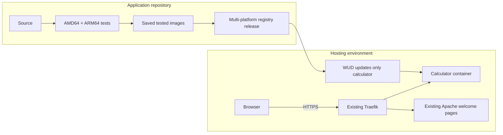

# 10 · Connect a tested application to the public host

[Contents](../README.md) · [Routing adapter](../examples/integrations/calculator/README.md)

## Learning goals

Connect independent infrastructure and application lifecycles. Trace an exact
tested image from GitHub through Docker Hub to a public HTTPS endpoint, then
verify a rollback without disturbing the web host.

## Two repositories, one contract

| Concern | Source of truth |
|---|---|
| Ubuntu, Docker install, DNS, firewall, proxy, certificates | `373_hosting` |
| Application code, Dockerfile, tests, registry publication | `is373_ci_cd` |
| Public network and Host-rule adapter | `373_hosting/examples/integrations/calculator` |
| Production start/update/rollback and updater credentials | `is373_ci_cd` Make interface |
| Public HTTPS release observation | This repository's `scripts/verify-release.py` |

The host can serve Apache pages without the calculator. The calculator can run
locally without the host. The shared contract is container HTTP port `8000`, a
published image, and `/health` identifying the running commit. Do not copy the
application source or CI workflow into this repository.



## Prerequisites

Complete Chapters 2–5: DNS and public 80/443 reach the host; Traefik and its
certificate store are working. Use the app revision containing the companion
integration and its first passing multi-platform release. Earlier demo images
are ARM64-only, whereas many VPS instances are AMD64.

Inspect `uname -m`, `sudo docker info --format '{{.Architecture}}'`, and
`sudo docker buildx imagetools inspect kaw393939/is373_ci_cd:prod` on the server.
An image name alone does not prove platform compatibility. Wait for a passing
publication that contains your platform before deploying; do not substitute a
local untested build as the production fallback.

## 1. Add an application hostname

Use a new name such as `calculator.example.org` pointing at your VPS. If that
zone already has a working wildcard DNS record, a specific A record may not be
necessary. Verify A and AAAA answers anyway. Do not add this name to the hosting
generator's `sites` list: doing so creates an Apache router competing with the
application router for the same name.

No existing welcome page needs to be replaced. The original class setup can use
`calculator.mywebclass.org` when intentionally deployed by its owner.

## 2. Install the adapter in the application checkout

The commands below assume both repositories are sibling directories under your
home directory on the server. Adjust paths if you used another location.

```bash
cd ~
git clone https://github.com/kaw393939/is373_ci_cd.git
cp ~/373_hosting/examples/integrations/calculator/compose.traefik.yaml ~/is373_ci_cd/compose.override.yaml
cd ~/is373_ci_cd
cp ~/373_hosting/examples/integrations/calculator/.env.example .env
nano .env
```

On an existing checkout, inspect and merge any existing override or `.env`
instead of overwriting it. Set `APP_HOST` to your application hostname. Set
`TRAEFIK_NETWORK` to the proxy's actual Docker network: `hosting-web` for the
book's generator, or `web` for the earlier classroom server. Inspect with
`sudo docker network ls`.

The adapter declares the network as external, attaches only `prod`, explicitly
selects that network for Traefik, and forwards the Host rule to port 8000. It
inherits the existing `websecure` certificate resolver. It starts no new proxy
and publishes no additional host ports.

## 3. Validate and deploy

On a clean first deployment, validate the two files without printing rendered
credentials:

```bash
sudo docker compose -f compose.yaml -f compose.override.yaml config --quiet
sudo make deploy
sudo make verify-production
```

`make deploy` starts only the published production application and its updater.
It does not build development. The app's operations check its selected local
image ID against the running container, then compare the expected commit with
loopback `/health`. All wrapper commands preserve the local override and
persisted release selection.

WUD's admin interface remains on loopback port 8091 with authentication. Do not
add a public Traefik route to it. If needed, tunnel it from your laptop with
`ssh -L 8091:127.0.0.1:8091 YOUR_USER@YOUR_SERVER_IP` and use its locally generated
credentials. WUD's Docker socket is powerful host access; do not expose that API.

## 4. Prove the public release

Copy the full expected commit from the successful publishing workflow summary,
not from an unverified public response. Run this check from a separate computer
or from the hosting checkout:

```bash
python3 scripts/verify-release.py \
  --url https://calculator.example.org \
  --expected-commit FULL_40_CHARACTER_COMMIT_FROM_THE_RELEASE
```

The script requires trusted HTTPS, an unchanged health URL, production
environment, and the expected commit. A correct health response does not exercise
the calculator UI: open the page and verify `6 × 7 = 42` in both browser and API
results. The application CI's native Playwright tests cover that flow before
publication; a public browser check also exercises the proxy connection.

## 5. Observe an update without touching infrastructure

Make an issue-linked change in the app repository. Its PR must pass both native
test jobs and the required `verify` gate. After merge, only a successful current
main run publishes the tested platform artifacts and advances `prod`.

WUD detects that digest change and replaces only the app's `prod` container.
Record its new container/image identity, check that the external network and
Traefik labels survived, and rerun the public release checker with the new
commit. Confirm a welcome page and the Traefik dashboard still work. A registry
push alone is not evidence of successful delivery.

## 6. Roll back and resume

Record a known-good **platform-compatible** release before updating. On the
application host:

```bash
sudo make rollback RELEASE=sha-FULL_KNOWN_GOOD_COMMIT
sudo make verify-production
```

This pauses WUD, persists the old image selection, and recreates only production.
Its actual image ID and health commit must match. A conflicting exported
`PROD_IMAGE` cannot override that persisted choice. Now rerun the public HTTPS
checker with the old commit and confirm unrelated sites still respond.

Resume only after the production channel is safe:

```bash
sudo make resume-updates
```

Verify the public commit again. Resumption deliberately returns to `prod`; it is
not a promise that the newest release is healthy. Keep `.state` and the override
file through routine operations. A single-container replacement causes a brief
interruption; this lesson does not implement zero-downtime releases.

## Assessment evidence

Submit workflow URL, tested commit, multi-platform index/child digest for your
architecture, running container identity, observed public health, and rollback
observations. Explain why these are separate evidence items. Never submit
registry tokens, updater credentials, or ACME keys.

The original hosting pages and local ARM64 demo were verified separately. The
calculator was subsequently deployed at `calc.mywebclass.org`; see the
[dated public deployment evidence](deployments/2026-09-29-calculator.md). That
record distinguishes initial deployment checks from future update/rollback
exercises.
